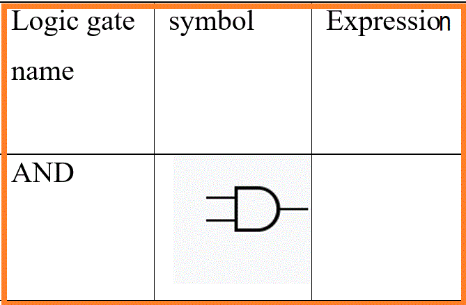
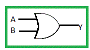
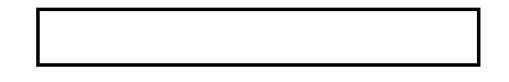
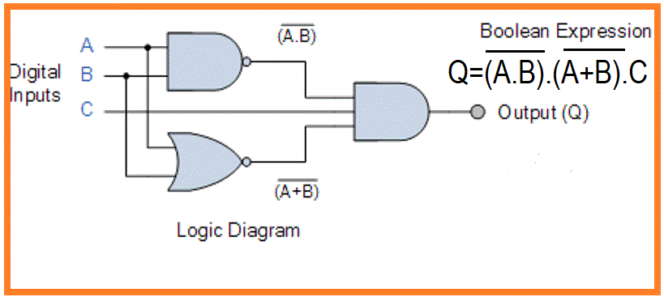

## Development Of Virtual lab:Round 1 (R1) Pedagogy

<strong>Name of Faculty : Deep Singh Thakur</strong>

<strong>Institute</strong> : Rajkiya Engineering College Banda

<strong>Email ID</strong> : deepst018@gmail.com

<strong>Discipline to which the Lab belongs : Electronics Engineering Lab</strong>

<strong>Name of experiment: To study logic gates and their truth table.</strong>

   
##   1.1 FOCUS AREA:  
 Reinforce theoretical concept.

## 1.2 About the Experiment:

The experiment is designed to explain the functioning of logic gates and draw their truth table.

## 1.3 Learning Objectives:

Write Learning Objectives that can be achieved using virtual labs and the respective cognitive level,  action verbs.

<table>
<tr>
<th>S.N</td><th>Learning Objective</th><th>Cognitive Level</th><th>Action Verb</th></tr>

<tr>
<td>1</td><td>Students will be able to <strong>identify</strong> different logic gates </td><td> Remember</td> <td> Identify </td></tr>

<tr><td> 2.</td><td>  Students will be able to <strong>explain</strong> functioning of different logic gates </td><td> Understand </td><td> Explain </td></tr>
<tr><td>3.</td><td>  Students will be able to <strong>predict</strong> the output of different logic gates and complete the truth table </td><td> Apply</td><td>  Predict </td></tr>
<tr><td> 4.</td><td>   Students will be able to <strong>solve</strong> the given logic circuit </td><td> Apply </td><td> Solve </td></tr>
</table>

## 2. Instructional Strategy:

Expository Instructional Strategy will be used for this virtual lab truth table of different logic gates
 

## 2.1 Instructional Strategy:

Expository

## 2.2 Assessment Method:

Formative assessment

## 2.3 Description of sections:

Students will first able to identify the symbols of different logic gates and then they will be made aware of their functioning and expression of their output for given inputs. Students then will calculate the output for given inputs and complete the truth table for a single logic gate. After students learned the functioning of simple logic gates they will analyze the circuit consist of a combination of logic gates. Students will then compare the logic gate circuit for the combination of the logic gate and will replace the gates with a universal gate.

## 3. Task Assessment Questions

Complete the following table with details of the various tasks and assessment question you will give to the students

<table width="612">
<tbody>
<tr>
<th width="68">

<strong>S.No.</strong>

</th>
<th width="334">

<strong>Learning Objective</strong>

</th>
<th width="115">

<strong>Tasks to be performed by the students</strong>

</td>
<th width="94">

<strong>Assessment Questions aligned to the task</strong>

</th>
</tr>
<tr>
<td width="68">

1

</td>
<td width="334">

Students will be able to identify Different basic logic gates

</td>
<td> Drag and drop the symbol and output expression of logic gate to corresponding input box.  </td>  <td> 
Drag and drop activity Students needs  to identify symbol of AND, OR, INVERTER, XOR,NAND, XNOR,NOR logic gates

</td></tr>

 <tr>
<td> 2. </td><td> Students will be able to explain functioning of different basic logic gates </td><td>
 Calculate the output of logic gates using given input </td><td> Drag and drop activity and input box for filling correct value of selected logic gate with given input 

e.g. OR gate expression is:

 

 
Q.) For input A= 1 and B=0 find the output Y= for above logic gate

 
</td>
 <tr>  </tr>
 </tr>

 </td></tr>

  
<tr><td>3.</td> <td> Students will be able to predict the output of different logic gates and complete the truth table for basic logic gates </td><td> Drop down menu to select the output of logic gate to complete the truth table </td><td> Q.) Use Drop down menu to complete the truth table<table>
<tr>
<td colspan="2"> input </td><td> output </td></tr>
<tr>
<td> A </td><td> B</td> <td> Y=A*B </td></tr>
<tr>
<td> 1</td> <td> 1 </td><td>   </td></tr>
<tr>
<td> 1</td> <td> 0</td> <td>   </td></tr>
<tr>
<td> 0</td> <td> 1</td><td>   </td></tr>
<tr>
<td> 0</td> <td> 0 </td>   <td> </td></tr></table></td></tr>

  <tr>
<td> 4. </td><td> Students will be able to solve the given logic circuit</td> <td>1.Drop down menu, to select the step by step output of logic gate circuit until final output is obtained.
2.write the output expression of logic gates based on given input

3.write the simplified expression of logic gates based on given input with the help of boolen function and Demorgan's law

Select the simplified expression of logic gates based on given  input
</td> 
<td>Drop down menu for step by step solution 

Q.1) Select the overall expression for the above logic circuit. 

 

Q.2) Select simplified expression.

 

</table>

## 4. Simulator Interactions
## Complete the following table giving the details of the Simulator interactions
<table>
<tr>
<th>
What students will do?
</th>
<th>What simulator will do?
</th>
<th>Purpose of the task
</th>
</tr>
<tr>
<td> Student will select the simulator button
</td>
<td>Simulator canvas will show up.Simulator will show the labels of logic gates and display the message 'select the active logic gate'
</td>
<td>To reach simulator section
</td>
</tr>
<tr>
<td>Student will click on logic gates label
</td>
<td>After selection of active label the color of label box will changed to green and text box with massage ‘select the active logic gate’ will disappear and two new text box will appear along with Output expressions and symbols of all logic gates.
 First text box will ask to drag and drop the symbol on the designated input box, and second text box will ask to drag and drop the output expression on the designated input box.

</td>
<td>To select the logic gate
</td>
</tr>
<tr>
<td>Student will use drag and drop option to put the symbol and expression of selected logic gate on designated input box 
</td>
<td>If the selected expression and symbol is correct, problem on selected logic gate with given input will appear with drop down menu at output. 
Otherwise Display the wrong answer message for incorrect selection.

</td>
<td>To identify the logic gates symbol and their expression
</td>
</tr>
<tr>
<td>
Student will complete the truth table
 
</td>
<td>
In case of correct answer simulator will show the NEXT button
Otherwise Display the wrong answer message for incorrect selection

</td>
<td>To understand the functioning of logic gate and to complete the truth table
</td>
</tr>
<tr>
<td>
Student will click on NEXT button

</td>
<td>
Simulator will change the color of earlier selected logic gate label as grey and it will be disabled.
 And will display the massage ‘select the active logic gate’.

</td>
<td>To select next logic gates
</td>
</tr>
<tr>
<td>
Now student will perform the above tasks until all the logic gates are completed and once the last logic gate truth table is completed student will click on next button

</td>
<td>
Simulator will show the combinational logic circuit with given input, which will consist of drop down menu at each step. 
Display the wrong answer message for every incorrect answer.
 
</td>
<td>To understand the functioning of logic gate and to complete the truth table
</td>
</tr>
<tr>
<td>
Student will click on drop down option at each stage to find the output of give combinational logic circuit 

</td>
<td>
Simulator will show the logic circuit. A massage will appear “select the correct overall expression of given circuit”
Simulator will also display the drop down menu of possible overall expression of given circuit. 
Display wrong answer message for incorrect answer. 
 
</td>
<td>To solve the logic gate circuit
</td>
</tr>
<tr>
<td>
Student will select the overall expression of given circuit using drop down menu 

</td>
<td>
Simulator will show the logic circuit. A massage will appear “select the correct simplified overall expression of given circuit”
Simulator will also display the drop down menu of possible simplified overall expression of given circuit. 
Display wrong answer message for incorrect answer.  
 
</td>
<td>Student will be able to solve the logic gate circuit.
</td>
</tr>
<tr>
<td>
Student will need to select the simplified overall expression from drop down menu 

</td>
<td>
Simulator will show the submit button. Star rating will appear on screen corresponding to attempt needed to perform the task on simulator
Try again message will displayed to repeat the experiment
Display wrong answer message for incorrect answer. 
 
</td>
<td>Student will be able to solve the logic gate circuit
</td>
</tr>
</table>