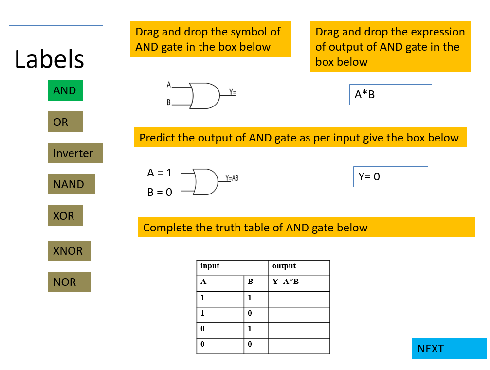
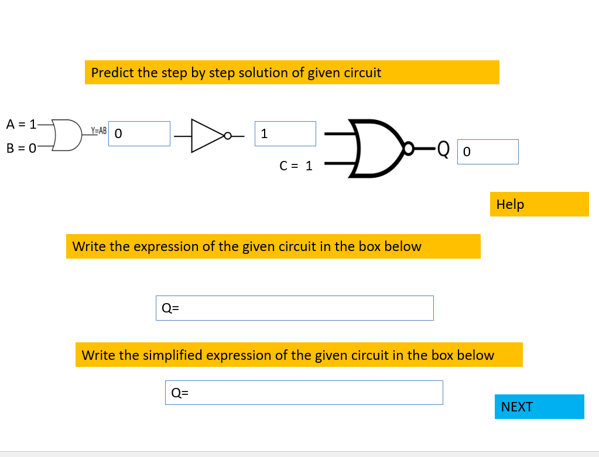

<b> Development Of Virtual lab:Round 2 (R2) Storyboard</b>

<strong>Name of Faculty : Deep Singh Thakur</strong>

<strong>Institute</strong> : Rajkiya Engineering College Banda

<strong>Email ID</strong> : deepst018@gmail.com

<strong>Discipline to which the Lab belongs : Electronics Engineering Lab</strong>

<strong>Name of experiment: To study logic gates and their truth table. </strong>

   
<b>   Round 2</b>

<strong>Experiment: To explain the functioning of logic gates and draw their truth table</strong>

<b> 2.1 Story Outline:  Simulator will help the student</b>

•	To understand the functioning of basic logic gates

•	To predict the correct output of basic logic gates

•	To complete the truth table of basic logic gates

•	To find the output of complex logic circuit and its final output expression in terms of input

Experiment has various sections like

Task 1

Section 1: Identification of active logic gates symbol and output expression in terms of input

Section 2: Predicting the output for given input of selected logic gate 

Section 3: completing the truth table of selected logic gate 

Task 1 will be repeated until all the basic logic gates are covered. Then task 2 will be unlocked 

Task 2

Section 4: predicting step by step solution of given logic circuit until correct output is obtained

Section 5: Finding  overall expression of given circuit.

Section 6: Finding simplified overall expression of given circuit with the help of Boolean function and Demorgen’s law

<b> 2. Story:</b>

<b> 2.1 Set the Visual Stage Description: Simulator outline is expressed page wise which will appear one by one</b> 

First page:  Label of logic gate will appear in the left section which will include the following basic gate AND, OR, NOT, XOR, XNOR, NAND, NOR. The appearance of the step by step section is as follows

1.	A text box will be on right side, which will ask the students to select the active logic gate label. 

2.	After selection of active label the color of label box will changed to green and text box will disappear. Now two new question boxes will appear on the right side which will asked the student to drag and drop the symbol and output expression on the designated box. If selection is incorrect a wrong selection message will appear.

3.	After correct selection of symbol and output expression a simple question based on selected logic gate will appear below the previous question section and students will be asked to fill the correct output in the input box. If answer is incorrect wrong answer message will appear.

4.	After correct answer new section will appear below previous question section which will have incomplete truth table of previously selected logic gate, 

5.	After correctly completing the truth table the selected label on the left side will turn grey and it cannot be selected.

6.	Now a text box will appear be on right side, which will ask the students to select the active logic gate label and proceed as above until all levels are turned grey.

7.	 The pictorial view is presented below for the same. Then next button will appear after all the levels are turned grey, on clicking the next button students will reach

Second Page: (task 2) 
The appearance of the step by step section is as follows
 

1.	 A logic circuit diagram will appear on the simulator screen which will consist of  combination of different logic gates 

2.	Students will predict the step by step output of the given circuit until final output is correctly predicted. Every output section will consist of drop down menu which will have option 0 and 1. 

3.	After successfully finding the final output correctly, a question will appear below the logic circuit which will ask the student to select the correct overall expression of given circuit using drop down menu

4.	After successfully finding the output expression another question will appear below the previous question section. This question will ask the student to select the correct simplified expression (by utilizing Boolean operation and/or Demorgan law) using drop down menu.

<b> 2.2 Set User Objectives & Goals:</b>

<b>Students should fulfill following to complete the experiment</b>

•     <strong>Identify</strong> the correct symbols and expression of basic logic gates

•	 <strong>Predict</strong> the output of all basic logic gates and 

•	 <strong>Complete</strong> the truth table of different basic logic gates

•	 <strong>Solve</strong> the given logic circuit to find the output, final output expression and simplified output expression

 

<b> 2.3 Set the Pathway Activities:</b> 

On the first page simulator will display the label of basic logic gates on left side and a text box will appear on right side which will display the ‘select the active label’. 

Task1: After student selects a label this message will disappear and student’s needs to select correct symbol and expression of selected logic gate using drag and drop option. 

Problem related to selected logic gate will appear which needs to be solved, and after that incomplete truth table will appear  which needs to be completed by selecting drop down option in output section of truth table. If answer is wrong Help box will be provided with hints. 

This process will continue till all the basic logic gates are covered

Task 2:  students need to solve the complex logic circuit step by step until final output is correctly obtained using drop down menu. Final expression of output and simplified expression of output (utilizing Boolean operation and/or Demorgan’s law) needs to be selected using drop down menu. If answer is wrong Help box will be provided with hints. 

<b> 2.4 Set Challenges and Questions/Complexity/Variations in Questions:</b>

two tasks available on simulator will be used to assess student performance
 

<b>2.6 Conclusion:</b>

Based on simulator task performance will be measured and displayed to the students in the form of star rating
 	

<b><b> 2.7 Equations/formulas:</b>
&nbsp;
</b>

<b> Identity:   1.X = X X + 0 = X  </b>

<b> Complementary:   X.X' = 0 X + X' = 1  </b>

<b> Commutative:    XY = YX X + Y = Y + X  </b>

<b> Distributive:   X(Y + Z) = XY + XZ X +YZ = (X + Y)(X + Z)  </b>

<b> Associative:  (XY)Z + X(YZ) (X + Y) + Z = X +(Y + Z)  </b>

<b> Negative:    0' = 1 1' = 0  </b>

<b> Double Negation:   (X')'  </b>

<b> Annihilation:   0.X = 0 1 + X = X  </b>

<b> Absorption:   X(X + Y) = X X + XY = X  </b>

<b> DeMorgan’s law:   (XY)' = X' + Y' (X + Y)' = X'Y'  </b>

